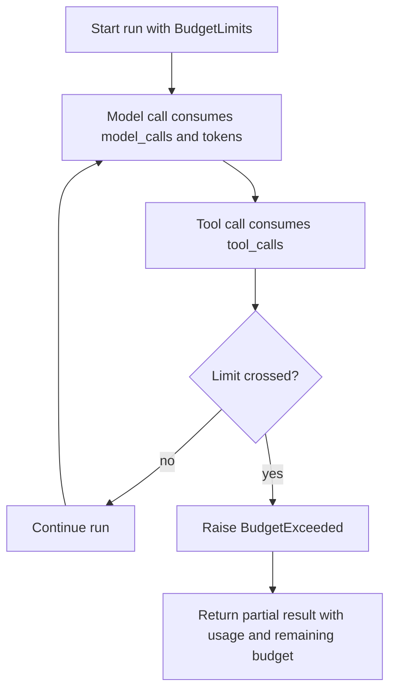

export const metadata = {
  title: "Cost and Tool Budgeting",
  description: "A working playground for bounding model calls, tool calls, tokens, handoffs, and partial results.",
  keywords: ["agent harness", "cost control", "budgeting", "tool limits", "python"]
}

# Cost and Tool Budgeting

Agent cost control is not only a billing problem. It is a runtime behavior problem. A single run can loop, retry, retrieve too much context, call too many tools, or keep handing work to other agents.

Cost and Tool Budgeting makes those limits explicit. The harness consumes budget before or during each operation and returns a partial result when a run is exhausted.

## Playground

Repo: [agent-harness-cookbook](https://github.com/shashikanth-gs/agent-harness-cookbook)

Source files:

- [example.py](https://github.com/shashikanth-gs/agent-harness-cookbook/blob/main/patterns/04-cost-and-tool-budgeting/pattern_cost_and_tool_budgeting/example.py)
- [tests](https://github.com/shashikanth-gs/agent-harness-cookbook/tree/main/patterns/04-cost-and-tool-budgeting/tests)
- [budget harness](https://github.com/shashikanth-gs/agent-harness-cookbook/blob/main/packages/agent_harness_cookbook/harness/budgets.py)
- [implementation spec](https://github.com/shashikanth-gs/agent-harness-cookbook/blob/main/patterns/04-cost-and-tool-budgeting/implementation-spec.md)

## Flow



## Code

The playground uses `BudgetTracker` and `BudgetLimits`.

```python
from pattern_cost_and_tool_budgeting import run_budgeted_flow

result = run_budgeted_flow()

assert result["status"] == "complete"
assert result["usage"]["model_calls"] == 2
assert result["remaining"]["tool_calls"] == 1
```

The exhaustion path is part of the contract, not an exception that disappears into logs.

```python
partial = run_budgeted_flow(extra_tool_call=True)

assert partial["status"] == "partial"
assert "remaining" in partial
assert "usage" in partial
```

## What Is Enforced

The example sets limits for model calls, tool calls, tokens, and agent handoffs. Each `consume()` call increments counters. If the increment crosses a limit, the run returns a partial status with usage and remaining capacity.

That lets the user see what happened: the agent did not just fail; it stopped because a budget boundary fired.

## Verification Scenarios

```bash
.venv/bin/python -m pytest -q patterns/04-cost-and-tool-budgeting/tests
```

These tests exercise budget enforcement during a run:

- A normal flow completes while staying inside model-call, tool-call, token, and handoff limits.
- An extra tool call exhausts the budget and returns a partial result instead of continuing silently.
- The result reports remaining budget, so callers can explain why the run stopped.

What this proves: budget limits are runtime controls, not dashboard-only metrics.

What this does not prove: it does not model every provider billing rule. It proves the harness boundary that stops a run when configured limits are crossed.

## When to Use It

Use this when an agent can loop, retry, call tools, call paid models, retrieve large context, or delegate to another agent.

The point is not to make agents cheap at any cost. The point is to make runtime spending bounded and visible.

## References

- OWASP Top 10 for LLMs (2025) — Unbounded Consumption (LLM10). [owasp.org](https://genai.owasp.org/2025/12/09/owasp-top-10-for-agentic-applications-the-benchmark-for-agentic-security-in-the-age-of-autonomous-ai/)
- Constraint drift in self-evolving LLM agents — long-running agents gradually shift from safety boundaries. [arxiv.org](https://arxiv.org/abs/2509.26354)

## See Also

- [Decision Trace and Audit](./03-decision-trace-and-audit.mdx)
- [Agent Evaluations](./10-agent-evaluations.mdx)
- [CI/CD Evaluation Gates](./11-ci-cd-evaluation-gates.mdx)

`agent-harness` `budgets` `runtime-limits`
