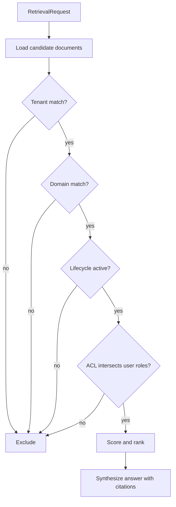

export const metadata = {
  title: "RAG Access Control and Provenance",
  description: "A working playground for filtering retrieval by authorization and carrying citations into answers.",
  keywords: ["agent harness", "rag", "access control", "provenance", "python"]
}

# RAG Access Control and Provenance

RAG systems usually optimize for relevance. Enterprise RAG also needs authorization. A document can be semantically perfect and still be the wrong document for this user, tenant, agent, or lifecycle state.

RAG Access Control and Provenance enforces access before answer synthesis and carries source metadata into the final answer.

## Playground

Repo: [agent-harness-cookbook](https://github.com/shashikanth-gs/agent-harness-cookbook)

Source files:

- [example.py](https://github.com/shashikanth-gs/agent-harness-cookbook/blob/main/patterns/07-rag-access-control-and-provenance/pattern_rag_access_control_and_provenance/example.py)
- [tests](https://github.com/shashikanth-gs/agent-harness-cookbook/tree/main/patterns/07-rag-access-control-and-provenance/tests)
- [document fixture](https://github.com/shashikanth-gs/agent-harness-cookbook/blob/main/patterns/07-rag-access-control-and-provenance/fixtures/documents.json)
- [implementation spec](https://github.com/shashikanth-gs/agent-harness-cookbook/blob/main/patterns/07-rag-access-control-and-provenance/implementation-spec.md)

## Flow



## Code

The request carries tenant, user roles, optional domain, and query.

```python
from pattern_rag_access_control_and_provenance import RetrievalRequest, retrieve, synthesize_answer

request = RetrievalRequest(
    query="orders api order_id",
    tenant="retail",
    user_roles=["support"],
    domain="orders",
)

results = retrieve(request)
answer = synthesize_answer(request.query, results)

assert answer["citation_valid"] is True
assert answer["citations"]
```

Each retrieved item includes provenance.

```python
{
    "doc_id": "runbook-orders-lag",
    "provenance": {
        "tenant": "retail",
        "domain": "orders",
        "lifecycle": "active",
        "acl_checked": True,
    },
}
```

## What Is Enforced

The retriever excludes documents from the wrong tenant, wrong domain, inactive lifecycle state, or non-overlapping ACL. Only authorized active documents can reach answer synthesis.

The answer returns citations, and citation validity depends on the retrieved sources still being active.

## Verification Scenarios

```bash
.venv/bin/python -m pytest -q patterns/07-rag-access-control-and-provenance/tests
```

These tests exercise authorization inside retrieval:

- An authorized support user retrieves an active document with provenance.
- Documents from the wrong tenant or role are filtered before answer synthesis.
- Deleted documents are excluded even if their text matches the query.
- Generated answers carry citations and validate that cited sources are active.
- Additional provenance tests check that retrieved chunks can be tied back to source metadata.

What this proves: relevance is not enough. The retriever must check authorization and lifecycle before the model sees the content.

What this does not prove: the fixture is not a full enterprise ReBAC system. It proves the retrieval contract: filter first, synthesize second, cite what was actually used.

## When to Use It

Use this for multi-tenant RAG, internal copilots, customer support agents, and any knowledge base where documents have different audiences.

If every document is public to every user, this can be lighter. If not, retrieval must be authorization-aware.

## References

- SkillInject — skill-file and instruction-file poisoning as a supply-chain attack surface. [arxiv.org](https://arxiv.org/abs/2602.20156)
- AgentDojo — adversarial tool-use evaluation over untrusted retrieved data. [agentdojo.spylab.ai](https://agentdojo.spylab.ai/)
- Authorization Propagation in Multi-Agent AI Systems — authorization must extend to retrieved content. [arxiv.org](https://arxiv.org/abs/2605.05440)

## See Also

- [Redaction Boundary](./05-redaction-boundary.mdx)
- [Prompt Injection and Goal Hijacking](./06-prompt-injection-and-goal-hijack.mdx)
- [Decision Trace and Audit](./03-decision-trace-and-audit.mdx)

`agent-harness` `rag` `provenance`
