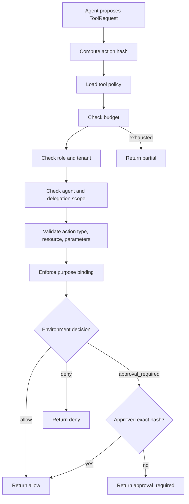

export const metadata = {
  title: "Tool Privilege Broker",
  description: "A working playground for enterprise action governance at the agent tool-call boundary.",
  keywords: ["agent harness", "tool calling", "least privilege", "agent security", "approval hash", "python"]
}

# Tool Privilege Broker

When you give an agent a tool, the question is not only "can the agent call this?" The real question is: who is asking, which tenant is involved, which agent is acting, is this a delegated child agent, what resource is targeted, which environment is affected, does the action match the original task, is there budget left, and does approval bind to this exact action?

The Tool Privilege Broker makes that question executable. The agent proposes a tool action. The broker decides `allow`, `deny`, `approval_required`, `allow_with_reduced_scope`, `return_partial`, or `escalate`. The model does not authorize itself.

## Playground

Repo: [agent-harness-cookbook](https://github.com/shashikanth-gs/agent-harness-cookbook)

Source files:

- [privilege_broker.py](https://github.com/shashikanth-gs/agent-harness-cookbook/blob/main/packages/agent_harness_cookbook/harness/privilege_broker.py)
- [example.py](https://github.com/shashikanth-gs/agent-harness-cookbook/blob/main/patterns/01-tool-privilege-broker/pattern_tool_privilege_broker/example.py)
- [tests](https://github.com/shashikanth-gs/agent-harness-cookbook/tree/main/patterns/01-tool-privilege-broker/tests)
- [policy fixture](https://github.com/shashikanth-gs/agent-harness-cookbook/blob/main/patterns/01-tool-privilege-broker/fixtures/tool_policy.json)
- [threat cases](https://github.com/shashikanth-gs/agent-harness-cookbook/blob/main/patterns/01-tool-privilege-broker/threat-cases.yaml)
- [implementation spec](https://github.com/shashikanth-gs/agent-harness-cookbook/blob/main/patterns/01-tool-privilege-broker/implementation-spec.md)

## Flow



## Code

A production restart is a write action against `orders-api`. It is valid for the task, but production policy requires approval.

```python
from pattern_tool_privilege_broker import propose_restart

decision = propose_restart("prod", ["ops-engineer"])

assert decision.decision == "approval_required"
assert decision.required_approver_role == "ops-lead"
assert decision.action_hash is not None
```

The request carries the action context the broker needs:

```python
from agent_harness_cookbook.harness.privilege_broker import ToolRequest

request = ToolRequest(
    agent_id="ops-investigator",
    user_id="user-123",
    user_roles=["ops-engineer"],
    tool_name="restart_service",
    parameters={"service": "orders-api", "environment": "prod"},
    environment="prod",
    tenant="retail",
    user_tenants=["retail"],
    action_type="write",
    resource="orders-api",
    original_task="Diagnose orders DLQ issue.",
)
```

Approval is bound to the exact action object. If the service changes after approval, the broker rejects the replay.

```python
from agent_harness_cookbook.harness.privilege_broker import ToolPrivilegeBroker, action_hash
from pattern_tool_privilege_broker import load_policy

approved_hash = action_hash(request)
changed = ToolRequest(
    **{
        **request.__dict__,
        "parameters": {"service": "inventory-api", "environment": "prod"},
        "resource": "inventory-api",
        "approval_status": "approved",
        "approval_action_hash": approved_hash,
    }
)

decision = ToolPrivilegeBroker(load_policy()).evaluate(changed)

assert decision.decision == "deny"
assert decision.reason == "approval action hash does not match requested action"
```

## What Is Enforced

The broker checks:

- tool registration,
- user role,
- tenant entitlement,
- allowed agent and delegated child-agent scope,
- action type,
- resource,
- network boundary,
- parameter names and values,
- destructive action denial,
- purpose binding to the original task,
- environment decision,
- exact approval action hash,
- remaining budget.

This is the boundary that contains prompt injection. If a poisoned document makes the model propose `restart_service` for an unrelated payment service, the broker can deny the action even when text detection misses the attack.

## Verification Scenarios

```bash
.venv/bin/python -m pytest -q patterns/01-tool-privilege-broker/tests
```

These tests exercise action governance:

- production restart requires approval and carries an action hash,
- development restart is allowed,
- unregistered or wrong-role tool use is denied,
- dev read-only evidence collection is allowed for a matching tenant and role,
- production destructive action is denied,
- the same tool is denied when the user lacks tenant entitlement,
- a delegated child agent cannot call a parent-only tool,
- approval replay with changed parameters is rejected,
- the exact approved action is allowed only after broker revalidation,
- a valid tool is denied when it violates the original task purpose,
- exhausted budget returns partial before tool work starts.

What this proves: tool access is governed by the full action context, not only by tool name.

What this does not prove: the JSON fixture is not a full enterprise policy engine. It is a local reference implementation of the decision contract that an enterprise policy system should preserve.

## When to Use It

Use this when agents can call tools with different risk levels, act across tenants, delegate to sub-agents, touch production, or require human approval.

Do not leave this to prompt instructions. Tool authorization belongs in deterministic code at the tool-call boundary.

## See Also

- [Prompt Injection and Goal Hijacking](./06-prompt-injection-and-goal-hijack.mdx)
- [HITL Approval Gate](./02-hitl-approval-gate.mdx)
- [Decision Trace and Audit](./03-decision-trace-and-audit.mdx)

`agent-harness` `tool-calling` `purpose-binding`
