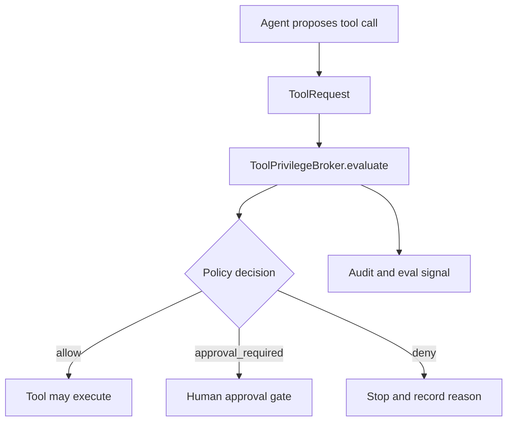

export const metadata = {
  title: "Tool Privilege Broker",
  description: "A working playground for enforcing agent tool access with deterministic policy decisions.",
  keywords: ["agent harness", "tool calling", "least privilege", "agent security", "python"]
}

# Tool Privilege Broker

When you give an agent a tool, the real question is not only "can the agent call this?" The question is "who is asking, which agent is acting, which parameters are being passed, which environment is targeted, and what policy decision applies?"

The Tool Privilege Broker pattern makes that question executable. The agent proposes a tool call. The broker decides `allow`, `approval_required`, or `deny`. The model does not get to authorize itself.

## Playground

Repo: [agent-harness-cookbook](https://github.com/shashikanth-gs/agent-harness-cookbook)

Source files:

- [example.py](https://github.com/shashikanth-gs/agent-harness-cookbook/blob/main/patterns/01-tool-privilege-broker/pattern_tool_privilege_broker/example.py)
- [tests](https://github.com/shashikanth-gs/agent-harness-cookbook/tree/main/patterns/01-tool-privilege-broker/tests)
- [policy fixture](https://github.com/shashikanth-gs/agent-harness-cookbook/blob/main/patterns/01-tool-privilege-broker/fixtures/tool_policy.json)
- [implementation spec](https://github.com/shashikanth-gs/agent-harness-cookbook/blob/main/patterns/01-tool-privilege-broker/implementation-spec.md)

## Flow



## Code

The example builds a concrete `ToolRequest` for a production restart and asks the broker to evaluate it.

```python
from pattern_tool_privilege_broker import propose_restart

decision = propose_restart("prod", ["ops-engineer"])

assert decision.decision == "approval_required"
assert decision.risk_level == "high"
```

Under the hood, the request carries agent id, user id, roles, tool name, parameters, and environment.

```python
ToolRequest(
    agent_id="ops-investigator",
    user_id="user-123",
    user_roles=["ops-engineer"],
    tool_name="restart_service",
    parameters={"service": "orders-api", "environment": "prod"},
    environment="prod",
)
```

## What Is Enforced

The broker checks that the tool is registered, the user role is allowed, every parameter is permitted, constrained values match policy, and the target environment has an explicit rule.

That means a production restart can require approval while the same action in development can be allowed. An unknown tool, wrong role, unknown parameter, or disallowed parameter value is denied before any tool execution happens.

## Verification Scenarios

```bash
.venv/bin/python -m pytest -q patterns/01-tool-privilege-broker/tests
```

These tests exercise the broker as an authorization boundary:

- A production restart by an ops engineer does not execute directly. It returns `approval_required`, because the target environment changes the risk.
- The same restart in development returns `allow`, because the policy treats lower environments differently.
- An unregistered tool returns `deny`, which proves the agent cannot invent tool names and get execution.
- A user without the required role returns `deny`, which proves authorization depends on the user context, not just the agent's request.

What this proves: the broker is enforcing role, tool, parameter, and environment policy before execution.

What this does not prove: the fixture is not a complete enterprise policy model. It is a focused playground for the core contract: agent proposal in, deterministic policy decision out.

## When to Use It

Use this when an agent can call tools with different risk levels, act on behalf of different users, or target multiple environments.

Do not leave this to prompt instructions. Tool authorization belongs in deterministic code.

## See Also

- [HITL Approval Gate](./02-hitl-approval-gate.mdx)
- [Decision Trace and Audit](./03-decision-trace-and-audit.mdx)
- [Sandboxed Execution](./09-sandboxed-execution.mdx)

`agent-harness` `tool-calling` `least-privilege`
