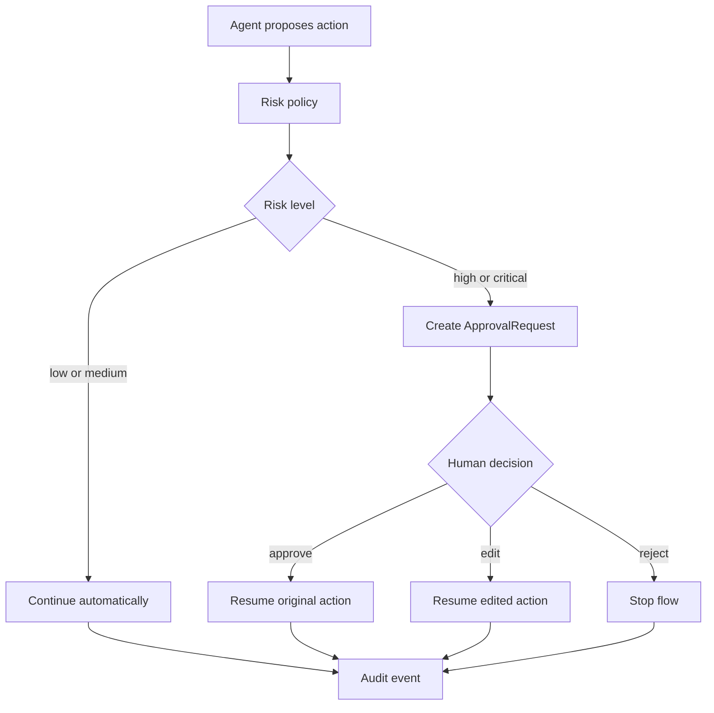

export const metadata = {
  title: "HITL Approval Gate",
  description: "A working playground for pausing agent flows only when human approval is actually required.",
  keywords: ["agent harness", "human in the loop", "approval workflow", "agent governance", "python"]
}

# HITL Approval Gate

Human review is useful when it is placed at the right boundary. If every read, summary, and low-risk step pauses for approval, the system stops being an agent workflow. If nothing pauses, high-risk actions can slip through without accountability.

The HITL Approval Gate pattern turns review into a precise runtime decision: skip, request approval, resume with approved or edited parameters, or stop on rejection.

## Playground

Repo: [agent-harness-cookbook](https://github.com/shashikanth-gs/agent-harness-cookbook)

Source files:

- [example.py](https://github.com/shashikanth-gs/agent-harness-cookbook/blob/main/patterns/02-hitl-approval-gate/pattern_hitl_approval_gate/example.py)
- [tests](https://github.com/shashikanth-gs/agent-harness-cookbook/tree/main/patterns/02-hitl-approval-gate/tests)
- [implementation spec](https://github.com/shashikanth-gs/agent-harness-cookbook/blob/main/patterns/02-hitl-approval-gate/implementation-spec.md)

## Flow



## Code

The concrete gate is small on purpose. It records skipped approvals for low-risk work and creates an `ApprovalRequest` for high-risk work.

```python
from agent_harness_cookbook.harness.audit import AuditStore
from pattern_hitl_approval_gate import ApprovalGate

audit = AuditStore()
gate = ApprovalGate(audit)

request = gate.maybe_pause(
    "restart_service",
    {"service": "orders-api", "environment": "prod"},
    "high",
)

assert request is not None

result = gate.resume(request.approve())
assert result["status"] == "resumed"
```

The important behavior is not the UI. It is the state transition: a high-risk action produces a pending request, and the resumed flow uses the approved or edited parameters.

## What Is Enforced

The gate fires only for `high` and `critical` risk in the example. Lower risk actions record `approval.skipped` and continue.

On rejection, `resume()` returns `{"status": "stopped"}`. The action does not execute. On approval, it returns the action and parameters to continue the flow.

## Verification Scenarios

```bash
.venv/bin/python -m pytest -q patterns/02-hitl-approval-gate/tests
```

These tests exercise the approval gate as a pause-and-resume boundary:

- A high-risk action creates an approval request instead of continuing automatically.
- A low-risk action records that approval was skipped and lets the workflow continue.
- A rejected approval stops the flow, so the original action is not executed later by accident.
- The demo records approval events in audit, so review decisions are visible after the run.

What this proves: human review is applied only at the risk boundary, and the resumed workflow follows the reviewer decision.

What this does not prove: it does not test a real approval UI or identity provider. The playground validates the state machine that a UI would sit on top of.

## When to Use It

Use this for irreversible actions, production changes, external messages, sensitive access, or expensive operations.

Do not use it as a blanket safety layer. The gate should protect decisions that deserve human judgment, not convert every agent step into manual work.

## See Also

- [Tool Privilege Broker](./01-tool-privilege-broker.mdx)
- [Decision Trace and Audit](./03-decision-trace-and-audit.mdx)
- [CI/CD Evaluation Gates](./11-ci-cd-evaluation-gates.mdx)

`agent-harness` `human-review` `approval-gate`
