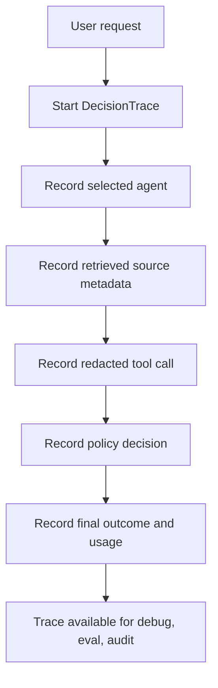

export const metadata = {
  title: "Decision Trace and Audit",
  description: "A working playground for reconstructing agent runs with structured, redacted trace events.",
  keywords: ["agent harness", "audit trail", "observability", "decision trace", "python"]
}

# Decision Trace and Audit

An agent run should be explainable after it finishes. Not by replaying a model call and hoping it behaves the same way, but by reading the trace the harness recorded while the run happened.

Decision Trace and Audit stores the observable evidence around a run: request, selected agent, retrieved sources, redacted tool calls, policy decisions, approvals, usage, and final outcome. It does not store private chain-of-thought.

## Playground

Repo: [agent-harness-cookbook](https://github.com/shashikanth-gs/agent-harness-cookbook)

Source files:

- [example.py](https://github.com/shashikanth-gs/agent-harness-cookbook/blob/main/patterns/03-decision-trace-and-audit/pattern_decision_trace_and_audit/example.py)
- [tests](https://github.com/shashikanth-gs/agent-harness-cookbook/tree/main/patterns/03-decision-trace-and-audit/tests)
- [trace harness](https://github.com/shashikanth-gs/agent-harness-cookbook/blob/main/packages/agent_harness_cookbook/harness/trace.py)
- [implementation spec](https://github.com/shashikanth-gs/agent-harness-cookbook/blob/main/patterns/03-decision-trace-and-audit/implementation-spec.md)

## Flow



## Code

The example builds a trace from a service incident investigation run.

```python
from pattern_decision_trace_and_audit import build_trace

trace = build_trace()

assert trace["trace_id"] == "trace-demo"
assert [step["name"] for step in trace["steps"]][-1] == "outcome.final"
```

The trace records events like this:

```python
trace.add("source.retrieved", {
    "source_id": "runbook-orders-lag",
    "lifecycle": "active",
})

trace.add("policy.decided", {
    "decision": "allow",
    "risk_level": "low",
})
```

## What Is Captured

The useful payloads are selected agent, source ids, lifecycle state, redacted tool parameters, broker decisions, approvals, latency, token usage, cost estimate, and outcome.

The non-goal is just as important: do not require or store private reasoning. The trace should reconstruct behavior from observable events.

## Verification Scenarios

```bash
.venv/bin/python -m pytest -q patterns/03-decision-trace-and-audit/tests
```

These tests exercise the trace as an operational record:

- Trace steps stay ordered, which lets a reviewer reconstruct the run timeline.
- Sensitive values in trace payloads are redacted before storage.
- The final outcome is captured without requiring private chain-of-thought fields.

What this proves: the trace can support debugging, audit, and evaluation without becoming a raw data dump.

What this does not prove: it does not prove a production retention policy, storage backend, or compliance program. It proves the event shape and redaction boundary used by the playground.

## When to Use It

Use this for agents that call tools, retrieve documents, require approval, influence user decisions, or need incident review.

Without this pattern, debugging agent systems becomes guesswork.

## See Also

- [Redaction Boundary](./05-redaction-boundary.mdx)
- [RAG Access Control and Provenance](./07-rag-access-control-and-provenance.mdx)
- [Agent Evaluations](./10-agent-evaluations.mdx)

`agent-harness` `audit` `decision-trace`
