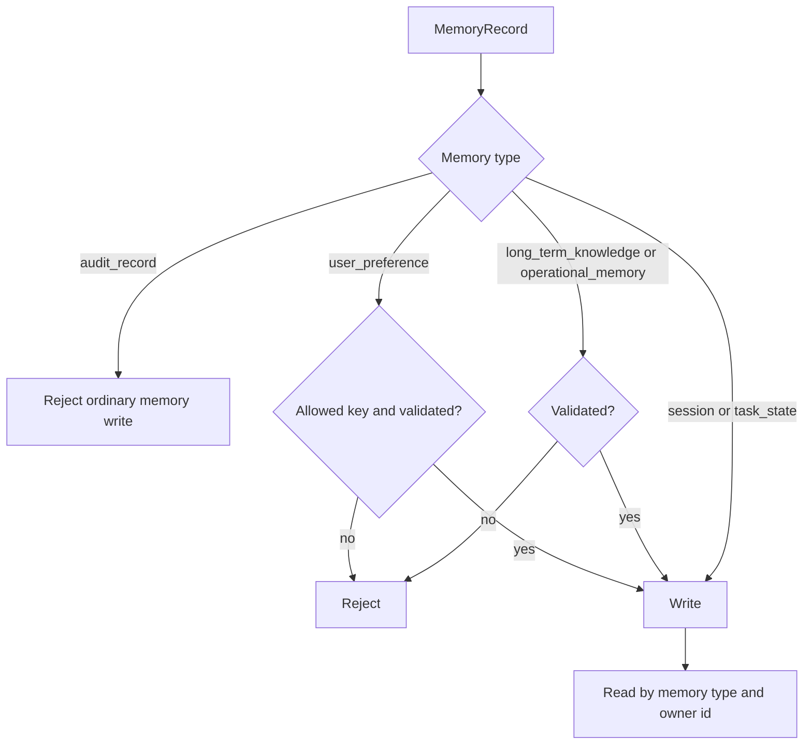

export const metadata = {
  title: "Memory Isolation",
  description: "A working playground for typed, owner-scoped, validated agent memory.",
  keywords: ["agent harness", "agent memory", "memory isolation", "multi-agent", "python"]
}

# Memory Isolation

Memory is not just persistence. In an agent system, memory decides what future runs can know. If that memory is shared loosely, one user, agent, or task can leak context into another.

Memory Isolation turns memory into a typed, owner-scoped, validated resource.

## Playground

Repo: [agent-harness-cookbook](https://github.com/shashikanth-gs/agent-harness-cookbook)

Source files:

- [example.py](https://github.com/shashikanth-gs/agent-harness-cookbook/blob/main/patterns/08-memory-isolation/pattern_memory_isolation/example.py)
- [tests](https://github.com/shashikanth-gs/agent-harness-cookbook/tree/main/patterns/08-memory-isolation/tests)
- [implementation spec](https://github.com/shashikanth-gs/agent-harness-cookbook/blob/main/patterns/08-memory-isolation/implementation-spec.md)

## Flow



## Code

The store enforces memory rules at write time.

```python
from pattern_memory_isolation import MemoryRecord, MemoryStore

store = MemoryStore()

store.write(MemoryRecord(
    memory_type="session",
    owner_id="user-demo",
    key="last_request",
    value="investigate orders",
    trust_level="low",
))

assert len(store.read("session", "user-demo")) == 1
assert len(store.read("session", "other-user")) == 0
```

Validation gates long-term memory.

```python
from pattern_memory_isolation import MemoryWriteRejected

try:
    store.write(MemoryRecord(
        memory_type="long_term_knowledge",
        owner_id="user-demo",
        key="fact",
        value="orders-api owns checkout",
        trust_level="medium",
        validated=False,
    ))
except MemoryWriteRejected:
    pass
```

## What Is Enforced

The playground defines memory types such as `session`, `user_preference`, `task_state`, `long_term_knowledge`, `operational_memory`, and `audit_record`.

User preferences require allowed keys and validation. Long-term and operational memory require validation. Audit records cannot be written through ordinary memory. Reads are scoped by memory type and owner.

## Verification Scenarios

```bash
.venv/bin/python -m pytest -q patterns/08-memory-isolation/tests
```

These tests exercise memory as a scoped resource:

- Session memory for one owner is not readable by another owner.
- User preference writes require both an allowed key and validation.
- Long-term knowledge cannot be written unless it has been validated.
- Audit records cannot be inserted through ordinary memory APIs.
- TTL and context gateway tests cover the deeper playground path for expiry and tenant context.

What this proves: memory writes are governed by type, owner, and validation status instead of being an unstructured shared store.

What this does not prove: it does not prove a production Redis, vector store, or database implementation. It proves the policy shape those backends should preserve.

## When to Use It

Use this when agents remember across requests, serve multiple users, collaborate with other agents, or promote generated content into future context.

For stateless single-turn agents, a trace may be enough. For long-running systems, memory needs governance.

## See Also

- [Decision Trace and Audit](./03-decision-trace-and-audit.mdx)
- [RAG Access Control and Provenance](./07-rag-access-control-and-provenance.mdx)
- [Agent Lifecycle Profile](./12-agent-lifecycle-profile.mdx)

`agent-harness` `agent-memory` `isolation`
