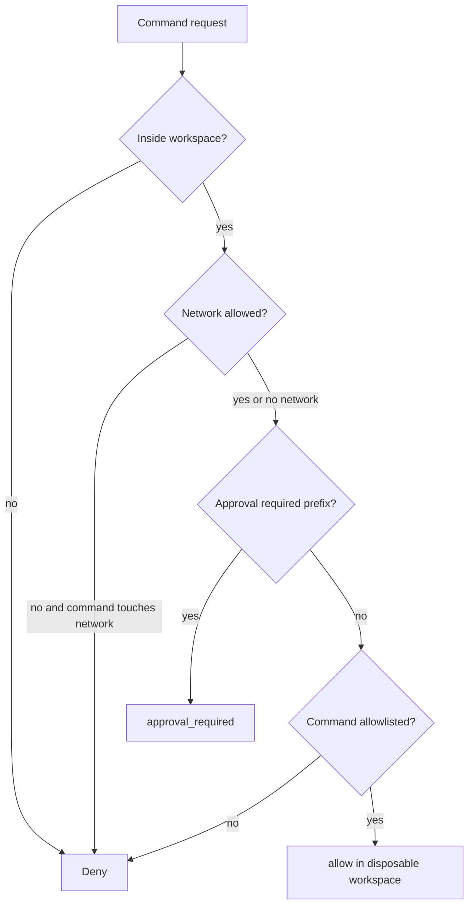

export const metadata = {
  title: "Sandboxed Execution",
  description: "A working playground for evaluating agent-directed commands before they touch files, network, or the host.",
  keywords: ["agent harness", "sandbox", "code execution", "tool security", "python"]
}

# Sandboxed Execution

An agent that can run code can affect the host unless the runtime prevents it. Prompt instructions do not stop filesystem reads, network calls, environment variable access, or risky commands.

Sandboxed Execution evaluates the command against execution policy before anything runs.

## Playground

Repo: [agent-harness-cookbook](https://github.com/shashikanth-gs/agent-harness-cookbook)

Source files:

- [example.py](https://github.com/shashikanth-gs/agent-harness-cookbook/blob/main/patterns/09-sandboxed-execution/pattern_sandboxed_execution/example.py)
- [tests](https://github.com/shashikanth-gs/agent-harness-cookbook/tree/main/patterns/09-sandboxed-execution/tests)
- [implementation spec](https://github.com/shashikanth-gs/agent-harness-cookbook/blob/main/patterns/09-sandboxed-execution/implementation-spec.md)

## Flow



## Code

The policy describes the allowed workspace, command allowlist, network mode, timeout, and risky commands.

```python
from pattern_sandboxed_execution import ExecutionPolicy, SandboxedExecutor

executor = SandboxedExecutor(ExecutionPolicy(
    workspace_root="/workspace/project",
    allowed_commands=["python -m pytest"],
    network="disabled",
    timeout_seconds=10,
    approval_required_commands=["git push"],
))

decision = executor.evaluate("python -m pytest", "/workspace/project")

assert decision.decision == "allow"
assert decision.timeout_seconds == 10
```

Risky or out-of-policy commands do not run.

```python
assert executor.evaluate("curl https://example.com", "/workspace/project", touches_network=True).decision == "deny"
assert executor.evaluate("git push origin main", "/workspace/project").decision == "approval_required"
```

## What Is Enforced

The example checks workspace root, network mode, approval-required command prefixes, command allowlist, and timeout metadata.

The `simulate()` path returns the decision without executing. That makes policy behavior easy to test before wiring in a real container runtime.

## Verification Scenarios

```bash
.venv/bin/python -m pytest -q patterns/09-sandboxed-execution/tests
```

These tests exercise command policy before execution:

- An allowlisted command inside the workspace is allowed, but still simulated in the playground.
- A command outside the workspace is denied.
- A command not present in the allowlist is denied.
- A risky command such as `git push` returns `approval_required`.
- Network-touching work is denied when network mode is disabled.
- Sandbox tests cover success, network block, and timeout behavior.

What this proves: the harness can decide whether execution should be allowed before handing control to a runtime.

What this does not prove: this specific example does not run a real container. It proves the policy decision contract a container runtime or subprocess wrapper must enforce.

## When to Use It

Use this for agents that run tests, shell commands, package managers, generated scripts, migrations, or deployment tools.

If the agent can execute, sandboxing is not optional infrastructure. It is the boundary between instruction and capability.

## See Also

- [Tool Privilege Broker](./01-tool-privilege-broker.mdx)
- [Prompt Injection and Goal Hijacking](./06-prompt-injection-and-goal-hijack.mdx)
- [HITL Approval Gate](./02-hitl-approval-gate.mdx)

`agent-harness` `sandbox` `execution-policy`
