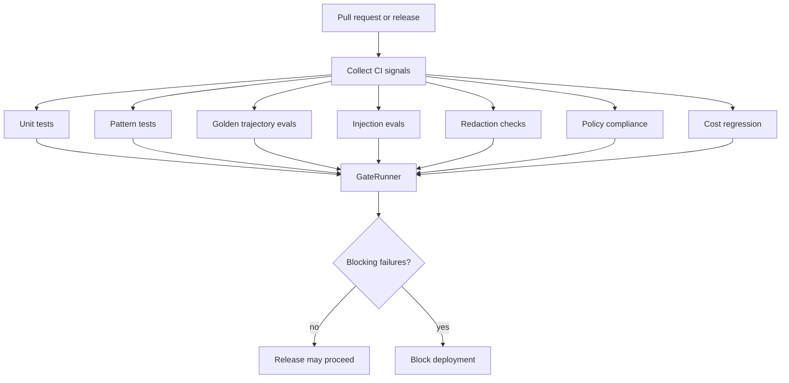

export const metadata = {
  title: "CI/CD Evaluation Gates",
  description: "A working playground for blocking unsafe agent changes in CI/CD.",
  keywords: ["agent harness", "ci cd", "evaluation gates", "regression testing", "python"]
}

# CI/CD Evaluation Gates

Agent behavior changes when prompts, tool definitions, model versions, policies, retrieval settings, and code change. A small diff can still alter runtime behavior.

CI/CD Evaluation Gates turn those behavior checks into release gates.

## Playground

Repo: [agent-harness-cookbook](https://github.com/shashikanth-gs/agent-harness-cookbook)

Source files:

- [example.py](https://github.com/shashikanth-gs/agent-harness-cookbook/blob/main/patterns/11-ci-cd-evaluation-gates/pattern_ci_cd_evaluation_gates/example.py)
- [tests](https://github.com/shashikanth-gs/agent-harness-cookbook/tree/main/patterns/11-ci-cd-evaluation-gates/tests)
- [implementation spec](https://github.com/shashikanth-gs/agent-harness-cookbook/blob/main/patterns/11-ci-cd-evaluation-gates/implementation-spec.md)

## Flow



## Code

The gate runner accepts raw CI signals and a list of required gates.

```python
from pattern_ci_cd_evaluation_gates import GateRunner

runner = GateRunner(["unit_tests", "pattern_tests", "policy_compliance"])

result = runner.evaluate({
    "unit_tests_passed": True,
    "pattern_tests_passed": True,
    "policy_violations": 0,
})

assert result.passed is True
assert result.blocking_failures == []
```

A failed required gate blocks the release.

```python
blocked = GateRunner(["injection_evals", "cost_regression"]).evaluate({
    "injection_evals_passed": False,
    "cost_regression_percent": 25.0,
    "max_cost_regression_percent": 10.0,
})

assert blocked.passed is False
```

## What Is Enforced

The playground supports unit tests, pattern tests, golden trajectory evals, injection evals, redaction checks, policy compliance, and cost regression thresholds.

The required gate list decides what blocks. That lets you start with cheap deterministic gates, then promote slower eval suites when they become reliable.

## Verification Scenarios

```bash
.venv/bin/python -m pytest -q patterns/11-ci-cd-evaluation-gates/tests
```

These tests exercise release gating behavior:

- Clean unit, pattern, and policy signals allow the gate to pass.
- Injection eval failure blocks release when injection evals are required.
- Cost regression blocks release when it crosses the configured threshold.
- Improvement and noise tests show that not every metric movement should block deployment.

What this proves: release decisions can be made from named signals and explicit required gates instead of manual confidence.

What this does not prove: the playground does not define your organization's final CI policy. It shows how to wire behavior signals into a blocking decision.

## When to Use It

Use this when prompts, tools, policies, retrieval settings, model versions, or agent code ship through a normal release process.

If a change can alter agent behavior, it should have a gate that can catch regressions.

## See Also

- [Agent Evaluations](./10-agent-evaluations.mdx)
- [Cost and Tool Budgeting](./04-cost-and-tool-budgeting.mdx)
- [Prompt Injection and Goal Hijacking](./06-prompt-injection-and-goal-hijack.mdx)

`agent-harness` `ci-cd` `eval-gates`
