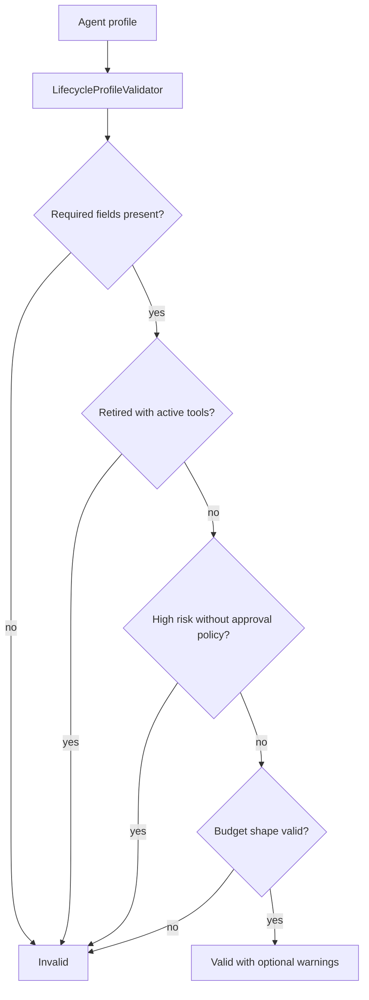

export const metadata = {
  title: "Agent Lifecycle Profile",
  description: "A working playground for validating agent ownership, purpose, risk, tools, budget, audit, and retirement state.",
  keywords: ["agent harness", "agent lifecycle", "agent governance", "agent profile", "python"]
}

# Agent Lifecycle Profile

An agent that moves beyond experimentation needs an identity. Who owns it? What is it allowed to do? What is it prohibited from doing? Which tools, data sources, budgets, approvals, evals, and audit requirements apply? What happens when it is retired?

Agent Lifecycle Profile turns those answers into a validated manifest.

## Playground

Repo: [agent-harness-cookbook](https://github.com/shashikanth-gs/agent-harness-cookbook)

Source files:

- [example.py](https://github.com/shashikanth-gs/agent-harness-cookbook/blob/main/patterns/12-agent-lifecycle-profile/pattern_agent_lifecycle_profile/example.py)
- [tests](https://github.com/shashikanth-gs/agent-harness-cookbook/tree/main/patterns/12-agent-lifecycle-profile/tests)
- [implementation spec](https://github.com/shashikanth-gs/agent-harness-cookbook/blob/main/patterns/12-agent-lifecycle-profile/implementation-spec.md)

## Flow



## Code

The validator checks whether a profile is complete enough to promote or select.

```python
from pattern_agent_lifecycle_profile import LifecycleProfileValidator

profile = {
    "agent_name": "service-incident-investigator",
    "owner": "platform-operations",
    "purpose": "Investigate generic service incidents.",
    "prohibited_use": ["automatic production remediation without approval"],
    "autonomy_tier": "assistive",
    "risk_level": "medium",
    "data_sources": ["mock_logs"],
    "model_provider": "mock_or_litellm",
    "tools": ["log_search"],
    "memory_policy": "session_only",
    "approval_policy": "required_for_high_risk_actions",
    "eval_suite": ["policy"],
    "budget": {"max_model_calls": 3, "max_tool_calls": 6, "max_tokens": 1200},
    "audit_requirements": ["request", "outcome"],
    "retirement": {"owner_review_required": True},
    "status": "active",
}

result = LifecycleProfileValidator().validate(profile)

assert result.valid is True
```

Retired agents with active tools are invalid.

```python
profile["status"] = "retired"
profile["tools"] = ["log_search"]

assert LifecycleProfileValidator().validate(profile).valid is False
```

## What Is Enforced

Required fields include agent name, owner, purpose, prohibited use, autonomy tier, risk level, data sources, model provider, tools, memory policy, approval policy, eval suite, budget, audit requirements, retirement rules, and status.

The validator rejects missing required fields, retired agents with active tools, high-risk agents without approval policy, missing prohibited use, and malformed budgets. It warns on unrestricted memory policy.

## Verification Scenarios

```bash
.venv/bin/python -m pytest -q patterns/12-agent-lifecycle-profile/tests
```

These tests exercise lifecycle validation:

- A complete active profile is valid.
- A profile missing an owner is invalid, because ownership is required for governance.
- A retired agent with active tools is invalid, because retirement must remove runtime capability.
- An unrestricted memory policy produces a warning, because it may be allowed temporarily but should be reviewed.
- Lifecycle manager tests cover the deeper playground path for status-aware agent handling.

What this proves: agent identity, ownership, budget, approval, memory, audit, and retirement fields can be validated before promotion or selection.

What this does not prove: it does not prove organizational review has happened. It proves the profile has the fields and rule checks needed for that review to be meaningful.

## When to Use It

Use this when agents become reusable, long-lived, production-adjacent, multi-team, or high-risk.

For experiments, keep it light. Before promotion, make the profile mandatory.

## See Also

- [Memory Isolation](./08-memory-isolation.mdx)
- [Cost and Tool Budgeting](./04-cost-and-tool-budgeting.mdx)
- [CI/CD Evaluation Gates](./11-ci-cd-evaluation-gates.mdx)

`agent-harness` `lifecycle` `governance`
